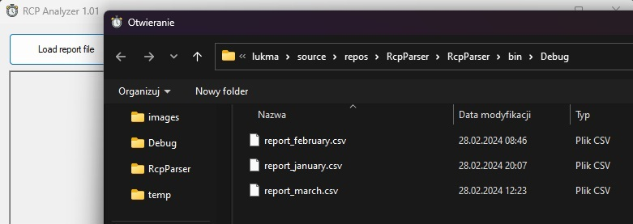

# Rcp Parser
_My application for analyzing working time based on data in csv format_

# Working - in brief
Run RcpParser.exe
 - Click "Load report file" and point to the file with the report.
 - The program will process the data and display a detailed analysis.

# Download
Click [link](https://github.com/lukmasko/Pinger2/raw/main/RcpParser_latest_x64_portable.zip) to download executable version 1.01.

# Screen
Load report file

Display analyze result

# Technology stack
 C#

# Dependencies
 - 
    
# Authors
Łukasz Maśko (lukmasko@gmail.com)

# License
...